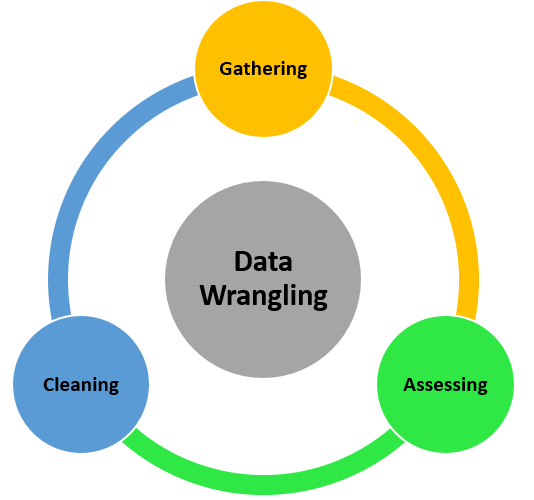

This presentation will detail data.tables data wrangling functionality, including:

- Manipulating data
- Modifying variables
- Summarizing data
- Chaining
- Joining
- Plotting data

We will end the presentation with an exercise. 


# What's data wrangling? 🤔
Data wrangling is the process of converting raw data to another format which can be readily analyzable. 



# data.table 📷
`data.table` provides an efficient and high performance alternative of base R's data.frame when conducting data wrangling. 

`data.table` enables this efficiency by providing: 

- concise syntax: fast to type, fast to read
- fast speed
- memory efficiency
- a large community
- rich features

To install the package, we use `install.packages('data.table')`.

## Importing with `fread()`

`data.table`'s efficiency begins from the outset with `fread()`, which is short for fast read is data.table's version of `read_csv()`.

Let's import and read the `mtcars` dataset and call it `mt` using `fread()`.

```r
library(data.table)
mt <- fread("mtcars.csv")
```

Let's check how fast `fread()` actually is it compared to `read.csv`. You can also write a file using `fwrite()` in `data.table` like `write.csv`. 

```r
# Create a large .csv file
set.seed(28)
trial <- data.frame(matrix(runif(10000000), nrow=1000000))
#write.csv(trial, 'trial.csv', row.names = F)
```

We can then see that `fread()` is at least 20 times faster! Let's check it out!

```r
# Time taken by read.csv to import
system.time({trial_df <- read.csv('trial.csv')})
```

```
##    user  system elapsed 
##   38.28    0.65   39.13
```

```r
# Time taken by fread to import
system.time({trial_df <- fread('trial.csv')})
```

```
##    user  system elapsed 
##    0.50    0.10    0.09
```

## Creating data tables
To highlight what a data table is, we will create data tables using different functions and compare the results with a data frame. Let's use a built-in R data called `airquality`.

```r
head(airquality)
```

<div class="kable-table">

| Ozone| Solar.R| Wind| Temp| Month| Day|
|-----:|-------:|----:|----:|-----:|---:|
|    41|     190|  7.4|   67|     5|   1|
|    36|     118|  8.0|   72|     5|   2|
|    12|     149| 12.6|   74|     5|   3|
|    18|     313| 11.5|   62|     5|   4|
|    NA|      NA| 14.3|   56|     5|   5|
|    28|      NA| 14.9|   66|     5|   6|

</div>

```r
class(airquality)
```

```
## [1] "data.frame"
```
To convert this data frame to a data table, we can either use:

* `data.table()` and `as.data.table()` - This function creates a copy of the data and converts it to a data.table

* `setDT()` - This function converts the data to a data.table, there is then no need to assign to a new object

We convert `airquality` data frame to a data table using `as.data.table`. It then becomes both a data table and a data frame.

```r
class(airquality)
```

```
## [1] "data.frame"
```

```r
airqualityDT <- as.data.table(airquality)
class(airqualityDT)
```

```
## [1] "data.table" "data.frame"
```

Now, we do the same for the `mt` data frame.

```r
mt <- as.data.frame(fread("mtcars.csv"))

class(mt)
```

```
## [1] "data.frame"
```

```r
setDT(mt) # we do not need to assign mt to a new object
class(mt)
```

```
## [1] "data.table" "data.frame"
```

```r
# for illustration purposes, let's use `as.data.table` and assign it to mtDT
mtDT <- as.data.table(mt)
class(mtDT)
```

```
## [1] "data.table" "data.frame"
```

We can "manually" create a data table using `data.table()`.

```r
DT <- data.table(x = 1:8,
                 y = round(pi*1:8,2),
                 z = letters[1:8])
knitr::kable(DT)
```


|  x|     y|z  |
|--:|-----:|:--|
|  1|  3.14|a  |
|  2|  6.28|b  |
|  3|  9.42|c  |
|  4| 12.57|d  |
|  5| 15.71|e  |
|  6| 18.85|f  |
|  7| 21.99|g  |
|  8| 25.13|h  |

Packages and functions that work with data frames also work for data tables. Since a data.table is a data.frame, it is compatible with R functions and packages that accept only data.frames.

```r
names(mtDT)
```

```
##  [1] "carname" "mpg"     "cyl"     "disp"    "hp"      "drat"    "wt"     
##  [8] "qsec"    "vs"      "am"      "gear"    "carb"
```

```r
dim(mtDT)
```

```
## [1] 32 12
```

```r
str(mtDT)
```

```
## Classes 'data.table' and 'data.frame':	32 obs. of  12 variables:
##  $ carname: chr  "Mazda RX4" "Mazda RX4 Wag" "Datsun 710" "Hornet 4 Drive" ...
##  $ mpg    : num  4.58 4.58 4.77 4.63 4.32 ...
##  $ cyl    : int  6 6 4 6 8 6 8 4 4 6 ...
##  $ disp   : num  160 160 108 258 360 ...
##  $ hp     : int  110 110 93 110 175 105 245 62 95 123 ...
##  $ drat   : num  3.9 3.9 3.85 3.08 3.15 2.76 3.21 3.69 3.92 3.92 ...
##  $ wt     : num  2.62 2.88 2.32 3.21 3.44 ...
##  $ qsec   : num  16.5 17 18.6 19.4 17 ...
##  $ vs     : int  0 0 1 1 0 1 0 1 1 1 ...
##  $ am     : int  1 1 1 0 0 0 0 0 0 0 ...
##  $ gear   : int  4 4 4 3 3 3 3 4 4 4 ...
##  $ carb   : int  4 4 1 1 2 1 4 2 2 4 ...
##  - attr(*, ".internal.selfref")=<externalptr>
```

For reference, the `mt` data has the following variables:

- [, 1]	**carname**   - Car name
- [, 2]	**mpg**   - Miles/(US) gallon
- [, 3]	**cyl**   - Number of cylinders
- [, 4]	**disp**  - Displacement (cu.in.)
- [, 5]	**hp**    - Gross horsepower
- [, 6]	**drat**  - Rear axle ratio
- [, 7]	**wt**    - Weight (1000 lbs)
- [, 8]	**qsec**  - 1/4 mile time
- [, 9]	**vs**    - Engine (0 = V-shaped, 1 = straight)
- [,10]	**am**    - Transmission (0 = automatic, 1 = manual)
- [,11]	**gear**  - Number of forward gears
- [,12]	**carb**  - Number of carburetors


# Data manipulation 🚗
When compared to a data frame, the basic arguments within brackets are **NOT** row and column numbers but rather "i", "j" and "by". 

For example, a data table named DT, DT[i, j, by] translates to "Take DT, subset rows using **i**, then calculate **j** grouped by **by**".

Use data.table subset [ operator the same way you would use data.frame one, but...

* no need to prefix each column with DT$ (like subset() and with() but built-in)
* any R expression using any package is allowed in j argument, not just list of columns
* extra argument by to compute j expression by group


Let's compare filtering using conditional statements in a data frame vs. in a data table. 
You will notice one of the primary benefits of data table, you only need to pass the column names!

```r
mt[mt$cyl == 6 & mt$gear == 4, ]
```

<div class="kable-table">

|carname       |      mpg| cyl|  disp|  hp| drat|    wt|  qsec| vs| am| gear| carb|
|:-------------|--------:|---:|-----:|---:|----:|-----:|-----:|--:|--:|----:|----:|
|Mazda RX4     | 4.582576|   6| 160.0| 110| 3.90| 2.620| 16.46|  0|  1|    4|    4|
|Mazda RX4 Wag | 4.582576|   6| 160.0| 110| 3.90| 2.875| 17.02|  0|  1|    4|    4|
|Merc 280      | 4.381780|   6| 167.6| 123| 3.92| 3.440| 18.30|  1|  0|    4|    4|
|Merc 280C     | 4.219005|   6| 167.6| 123| 3.92| 3.440| 18.90|  1|  0|    4|    4|

</div>

```r
# datatable syntax
mtDT[cyl==6 & gear==4, ]
```

<div class="kable-table">

|carname       |      mpg| cyl|  disp|  hp| drat|    wt|  qsec| vs| am| gear| carb|
|:-------------|--------:|---:|-----:|---:|----:|-----:|-----:|--:|--:|----:|----:|
|Mazda RX4     | 4.582576|   6| 160.0| 110| 3.90| 2.620| 16.46|  0|  1|    4|    4|
|Mazda RX4 Wag | 4.582576|   6| 160.0| 110| 3.90| 2.875| 17.02|  0|  1|    4|    4|
|Merc 280      | 4.381780|   6| 167.6| 123| 3.92| 3.440| 18.30|  1|  0|    4|    4|
|Merc 280C     | 4.219005|   6| 167.6| 123| 3.92| 3.440| 18.90|  1|  0|    4|    4|

</div>

## Filtering rows
Selecting rows is largely similar to data frame.


```r
# select a row
mtDT[1,]
```

<div class="kable-table">

|carname   |      mpg| cyl| disp|  hp| drat|   wt|  qsec| vs| am| gear| carb|
|:---------|--------:|---:|----:|---:|----:|----:|-----:|--:|--:|----:|----:|
|Mazda RX4 | 4.582576|   6|  160| 110|  3.9| 2.62| 16.46|  0|  1|    4|    4|

</div>

```r
# selecting first five rows
mtDT[1:5,]
```

<div class="kable-table">

|carname           |      mpg| cyl| disp|  hp| drat|    wt|  qsec| vs| am| gear| carb|
|:-----------------|--------:|---:|----:|---:|----:|-----:|-----:|--:|--:|----:|----:|
|Mazda RX4         | 4.582576|   6|  160| 110| 3.90| 2.620| 16.46|  0|  1|    4|    4|
|Mazda RX4 Wag     | 4.582576|   6|  160| 110| 3.90| 2.875| 17.02|  0|  1|    4|    4|
|Datsun 710        | 4.774935|   4|  108|  93| 3.85| 2.320| 18.61|  1|  1|    4|    1|
|Hornet 4 Drive    | 4.626013|   6|  258| 110| 3.08| 3.215| 19.44|  1|  0|    3|    1|
|Hornet Sportabout | 4.324350|   8|  360| 175| 3.15| 3.440| 17.02|  0|  0|    3|    2|

</div>

```r
# no need to put comma in selecting rows
mtDT[1:2]
```

<div class="kable-table">

|carname       |      mpg| cyl| disp|  hp| drat|    wt|  qsec| vs| am| gear| carb|
|:-------------|--------:|---:|----:|---:|----:|-----:|-----:|--:|--:|----:|----:|
|Mazda RX4     | 4.582576|   6|  160| 110|  3.9| 2.620| 16.46|  0|  1|    4|    4|
|Mazda RX4 Wag | 4.582576|   6|  160| 110|  3.9| 2.875| 17.02|  0|  1|    4|    4|

</div>

```r
# subsetting using conditional statements
mtDT[cyl < 5 & am == 0]
```

<div class="kable-table">

|carname       |      mpg| cyl|  disp| hp| drat|    wt|  qsec| vs| am| gear| carb|
|:-------------|--------:|---:|-----:|--:|----:|-----:|-----:|--:|--:|----:|----:|
|Merc 240D     | 4.939636|   4| 146.7| 62| 3.69| 3.190| 20.00|  1|  0|    4|    2|
|Merc 230      | 4.774935|   4| 140.8| 95| 3.92| 3.150| 22.90|  1|  0|    4|    2|
|Toyota Corona | 4.636809|   4| 120.1| 97| 3.70| 2.465| 20.01|  1|  0|    3|    1|

</div>

```r
mtDT[cyl %between% c(5,8)] # conditions a range of values
```

<div class="kable-table">

|carname             |      mpg| cyl|  disp|  hp| drat|    wt|  qsec| vs| am| gear| carb|
|:-------------------|--------:|---:|-----:|---:|----:|-----:|-----:|--:|--:|----:|----:|
|Mazda RX4           | 4.582576|   6| 160.0| 110| 3.90| 2.620| 16.46|  0|  1|    4|    4|
|Mazda RX4 Wag       | 4.582576|   6| 160.0| 110| 3.90| 2.875| 17.02|  0|  1|    4|    4|
|Hornet 4 Drive      | 4.626013|   6| 258.0| 110| 3.08| 3.215| 19.44|  1|  0|    3|    1|
|Hornet Sportabout   | 4.324350|   8| 360.0| 175| 3.15| 3.440| 17.02|  0|  0|    3|    2|
|Valiant             | 4.254410|   6| 225.0| 105| 2.76| 3.460| 20.22|  1|  0|    3|    1|
|Duster 360          | 3.781534|   8| 360.0| 245| 3.21| 3.570| 15.84|  0|  0|    3|    4|
|Merc 280            | 4.381780|   6| 167.6| 123| 3.92| 3.440| 18.30|  1|  0|    4|    4|
|Merc 280C           | 4.219005|   6| 167.6| 123| 3.92| 3.440| 18.90|  1|  0|    4|    4|
|Merc 450SE          | 4.049691|   8| 275.8| 180| 3.07| 4.070| 17.40|  0|  0|    3|    3|
|Merc 450SL          | 4.159327|   8| 275.8| 180| 3.07| 3.730| 17.60|  0|  0|    3|    3|
|Merc 450SLC         | 3.898718|   8| 275.8| 180| 3.07| 3.780| 18.00|  0|  0|    3|    3|
|Cadillac Fleetwood  | 3.224903|   8| 472.0| 205| 2.93| 5.250| 17.98|  0|  0|    3|    4|
|Lincoln Continental | 3.224903|   8| 460.0| 215| 3.00| 5.424| 17.82|  0|  0|    3|    4|
|Chrysler Imperial   | 3.834058|   8| 440.0| 230| 3.23| 5.345| 17.42|  0|  0|    3|    4|
|Dodge Challenger    | 3.937004|   8| 318.0| 150| 2.76| 3.520| 16.87|  0|  0|    3|    2|
|AMC Javelin         | 3.898718|   8| 304.0| 150| 3.15| 3.435| 17.30|  0|  0|    3|    2|
|Camaro Z28          | 3.646917|   8| 350.0| 245| 3.73| 3.840| 15.41|  0|  0|    3|    4|
|Pontiac Firebird    | 4.381780|   8| 400.0| 175| 3.08| 3.845| 17.05|  0|  0|    3|    2|
|Ford Pantera L      | 3.974921|   8| 351.0| 264| 4.22| 3.170| 14.50|  0|  1|    5|    4|
|Ferrari Dino        | 4.438468|   6| 145.0| 175| 3.62| 2.770| 15.50|  0|  1|    5|    6|
|Maserati Bora       | 3.872983|   8| 301.0| 335| 3.54| 3.570| 14.60|  0|  1|    5|    8|

</div>

```r
mtDT[carname %like% "Mazda"] # finds a pattern
```

<div class="kable-table">

|carname       |      mpg| cyl| disp|  hp| drat|    wt|  qsec| vs| am| gear| carb|
|:-------------|--------:|---:|----:|---:|----:|-----:|-----:|--:|--:|----:|----:|
|Mazda RX4     | 4.582576|   6|  160| 110|  3.9| 2.620| 16.46|  0|  1|    4|    4|
|Mazda RX4 Wag | 4.582576|   6|  160| 110|  3.9| 2.875| 17.02|  0|  1|    4|    4|

</div>

## Selecting columns
There are some pointers you have to remember to select  a column.

```r
# using index
mtDT[,1:2]
```

<div class="kable-table">

|carname             |      mpg|
|:-------------------|--------:|
|Mazda RX4           | 4.582576|
|Mazda RX4 Wag       | 4.582576|
|Datsun 710          | 4.774935|
|Hornet 4 Drive      | 4.626013|
|Hornet Sportabout   | 4.324350|
|Valiant             | 4.254410|
|Duster 360          | 3.781534|
|Merc 240D           | 4.939636|
|Merc 230            | 4.774935|
|Merc 280            | 4.381780|
|Merc 280C           | 4.219005|
|Merc 450SE          | 4.049691|
|Merc 450SL          | 4.159327|
|Merc 450SLC         | 3.898718|
|Cadillac Fleetwood  | 3.224903|
|Lincoln Continental | 3.224903|
|Chrysler Imperial   | 3.834058|
|Fiat 128            | 5.692100|
|Honda Civic         | 5.513619|
|Toyota Corolla      | 5.822371|
|Toyota Corona       | 4.636809|
|Dodge Challenger    | 3.937004|
|AMC Javelin         | 3.898718|
|Camaro Z28          | 3.646917|
|Pontiac Firebird    | 4.381780|
|Fiat X1-9           | 5.224940|
|Porsche 914-2       | 5.099019|
|Lotus Europa        | 5.513619|
|Ford Pantera L      | 3.974921|
|Ferrari Dino        | 4.438468|
|Maserati Bora       | 3.872983|
|Volvo 142E          | 4.626013|

</div>

```r
# using column name
mtDT[ , mpg] # returns a vector
```

```
##  [1] 4.582576 4.582576 4.774935 4.626013 4.324350 4.254409 3.781534 4.939636
##  [9] 4.774935 4.381780 4.219005 4.049691 4.159327 3.898718 3.224903 3.224903
## [17] 3.834058 5.692100 5.513620 5.822371 4.636809 3.937004 3.898718 3.646917
## [25] 4.381780 5.224940 5.099020 5.513620 3.974921 4.438468 3.872983 4.626013
```

```r
mtDT[ , "mpg"] # returns the column
```

<div class="kable-table">

|      mpg|
|--------:|
| 4.582576|
| 4.582576|
| 4.774935|
| 4.626013|
| 4.324350|
| 4.254410|
| 3.781534|
| 4.939636|
| 4.774935|
| 4.381780|
| 4.219005|
| 4.049691|
| 4.159327|
| 3.898718|
| 3.224903|
| 3.224903|
| 3.834058|
| 5.692100|
| 5.513619|
| 5.822371|
| 4.636809|
| 3.937004|
| 3.898718|
| 3.646917|
| 4.381780|
| 5.224940|
| 5.099019|
| 5.513619|
| 3.974921|
| 4.438468|
| 3.872983|
| 4.626013|

</div>

```r
# selecting multiple columns using "list" or puting inside ".()"
mtDT[, list(mpg, cyl)]
```

<div class="kable-table">

|      mpg| cyl|
|--------:|---:|
| 4.582576|   6|
| 4.582576|   6|
| 4.774935|   4|
| 4.626013|   6|
| 4.324350|   8|
| 4.254410|   6|
| 3.781534|   8|
| 4.939636|   4|
| 4.774935|   4|
| 4.381780|   6|
| 4.219005|   6|
| 4.049691|   8|
| 4.159327|   8|
| 3.898718|   8|
| 3.224903|   8|
| 3.224903|   8|
| 3.834058|   8|
| 5.692100|   4|
| 5.513619|   4|
| 5.822371|   4|
| 4.636809|   4|
| 3.937004|   8|
| 3.898718|   8|
| 3.646917|   8|
| 4.381780|   8|
| 5.224940|   4|
| 5.099019|   4|
| 5.513619|   4|
| 3.974921|   8|
| 4.438468|   6|
| 3.872983|   8|
| 4.626013|   4|

</div>

```r
mtDT[, .(mpg, cyl)]
```

<div class="kable-table">

|      mpg| cyl|
|--------:|---:|
| 4.582576|   6|
| 4.582576|   6|
| 4.774935|   4|
| 4.626013|   6|
| 4.324350|   8|
| 4.254410|   6|
| 3.781534|   8|
| 4.939636|   4|
| 4.774935|   4|
| 4.381780|   6|
| 4.219005|   6|
| 4.049691|   8|
| 4.159327|   8|
| 3.898718|   8|
| 3.224903|   8|
| 3.224903|   8|
| 3.834058|   8|
| 5.692100|   4|
| 5.513619|   4|
| 5.822371|   4|
| 4.636809|   4|
| 3.937004|   8|
| 3.898718|   8|
| 3.646917|   8|
| 4.381780|   8|
| 5.224940|   4|
| 5.099019|   4|
| 5.513619|   4|
| 3.974921|   8|
| 4.438468|   6|
| 3.872983|   8|
| 4.626013|   4|

</div>

```r
# selecting multiple columns using a character vector
col <- c('mpg', 'cyl', 'disp')

#mtDT[, col] # returns an error

# need to put, with = FALSE, or add ".." before the character vector
mtDT[, col, with = FALSE]
```

<div class="kable-table">

|      mpg| cyl|  disp|
|--------:|---:|-----:|
| 4.582576|   6| 160.0|
| 4.582576|   6| 160.0|
| 4.774935|   4| 108.0|
| 4.626013|   6| 258.0|
| 4.324350|   8| 360.0|
| 4.254410|   6| 225.0|
| 3.781534|   8| 360.0|
| 4.939636|   4| 146.7|
| 4.774935|   4| 140.8|
| 4.381780|   6| 167.6|
| 4.219005|   6| 167.6|
| 4.049691|   8| 275.8|
| 4.159327|   8| 275.8|
| 3.898718|   8| 275.8|
| 3.224903|   8| 472.0|
| 3.224903|   8| 460.0|
| 3.834058|   8| 440.0|
| 5.692100|   4|  78.7|
| 5.513619|   4|  75.7|
| 5.822371|   4|  71.1|
| 4.636809|   4| 120.1|
| 3.937004|   8| 318.0|
| 3.898718|   8| 304.0|
| 3.646917|   8| 350.0|
| 4.381780|   8| 400.0|
| 5.224940|   4|  79.0|
| 5.099019|   4| 120.3|
| 5.513619|   4|  95.1|
| 3.974921|   8| 351.0|
| 4.438468|   6| 145.0|
| 3.872983|   8| 301.0|
| 4.626013|   4| 121.0|

</div>

```r
mtDT[, ..col]
```

<div class="kable-table">

|      mpg| cyl|  disp|
|--------:|---:|-----:|
| 4.582576|   6| 160.0|
| 4.582576|   6| 160.0|
| 4.774935|   4| 108.0|
| 4.626013|   6| 258.0|
| 4.324350|   8| 360.0|
| 4.254410|   6| 225.0|
| 3.781534|   8| 360.0|
| 4.939636|   4| 146.7|
| 4.774935|   4| 140.8|
| 4.381780|   6| 167.6|
| 4.219005|   6| 167.6|
| 4.049691|   8| 275.8|
| 4.159327|   8| 275.8|
| 3.898718|   8| 275.8|
| 3.224903|   8| 472.0|
| 3.224903|   8| 460.0|
| 3.834058|   8| 440.0|
| 5.692100|   4|  78.7|
| 5.513619|   4|  75.7|
| 5.822371|   4|  71.1|
| 4.636809|   4| 120.1|
| 3.937004|   8| 318.0|
| 3.898718|   8| 304.0|
| 3.646917|   8| 350.0|
| 4.381780|   8| 400.0|
| 5.224940|   4|  79.0|
| 5.099019|   4| 120.3|
| 5.513619|   4|  95.1|
| 3.974921|   8| 351.0|
| 4.438468|   6| 145.0|
| 3.872983|   8| 301.0|
| 4.626013|   4| 121.0|

</div>

## Subsetting rows and columns
Combing what we learned above, we can filter rows and select columns together from a data table.

```r
# selecting first row, second column
mtDT[1,2] # returns the column
```

<div class="kable-table">

|      mpg|
|--------:|
| 4.582576|

</div>

```r
mtDT[1,cyl] # returns a vector
```

```
## [1] 6
```

```r
mtDT[1,"cyl"] # returns the column
```

<div class="kable-table">

| cyl|
|---:|
|   6|

</div>

```r
mtDT[1,list(mpg, cyl)] # returns the column
```

<div class="kable-table">

|      mpg| cyl|
|--------:|---:|
| 4.582576|   6|

</div>

```r
mtDT[1, .(mpg, cyl)] # returns the column
```

<div class="kable-table">

|      mpg| cyl|
|--------:|---:|
| 4.582576|   6|

</div>

```r
mtDT[1, c(mpg, cyl)] # returns a vector
```

```
## [1] 4.582576 6.000000
```

# Modifying variables 🔑

Data.table also makes it easy to:

- Drop columns; 
- Rename columns; and 
- Assign and save new variables. 

## Dropping columns

```r
col <- c('mpg', 'cyl', 'disp')

mtDT[, !col, with = FALSE]
```

<div class="kable-table">

|carname             |  hp| drat|    wt|  qsec| vs| am| gear| carb|
|:-------------------|---:|----:|-----:|-----:|--:|--:|----:|----:|
|Mazda RX4           | 110| 3.90| 2.620| 16.46|  0|  1|    4|    4|
|Mazda RX4 Wag       | 110| 3.90| 2.875| 17.02|  0|  1|    4|    4|
|Datsun 710          |  93| 3.85| 2.320| 18.61|  1|  1|    4|    1|
|Hornet 4 Drive      | 110| 3.08| 3.215| 19.44|  1|  0|    3|    1|
|Hornet Sportabout   | 175| 3.15| 3.440| 17.02|  0|  0|    3|    2|
|Valiant             | 105| 2.76| 3.460| 20.22|  1|  0|    3|    1|
|Duster 360          | 245| 3.21| 3.570| 15.84|  0|  0|    3|    4|
|Merc 240D           |  62| 3.69| 3.190| 20.00|  1|  0|    4|    2|
|Merc 230            |  95| 3.92| 3.150| 22.90|  1|  0|    4|    2|
|Merc 280            | 123| 3.92| 3.440| 18.30|  1|  0|    4|    4|
|Merc 280C           | 123| 3.92| 3.440| 18.90|  1|  0|    4|    4|
|Merc 450SE          | 180| 3.07| 4.070| 17.40|  0|  0|    3|    3|
|Merc 450SL          | 180| 3.07| 3.730| 17.60|  0|  0|    3|    3|
|Merc 450SLC         | 180| 3.07| 3.780| 18.00|  0|  0|    3|    3|
|Cadillac Fleetwood  | 205| 2.93| 5.250| 17.98|  0|  0|    3|    4|
|Lincoln Continental | 215| 3.00| 5.424| 17.82|  0|  0|    3|    4|
|Chrysler Imperial   | 230| 3.23| 5.345| 17.42|  0|  0|    3|    4|
|Fiat 128            |  66| 4.08| 2.200| 19.47|  1|  1|    4|    1|
|Honda Civic         |  52| 4.93| 1.615| 18.52|  1|  1|    4|    2|
|Toyota Corolla      |  65| 4.22| 1.835| 19.90|  1|  1|    4|    1|
|Toyota Corona       |  97| 3.70| 2.465| 20.01|  1|  0|    3|    1|
|Dodge Challenger    | 150| 2.76| 3.520| 16.87|  0|  0|    3|    2|
|AMC Javelin         | 150| 3.15| 3.435| 17.30|  0|  0|    3|    2|
|Camaro Z28          | 245| 3.73| 3.840| 15.41|  0|  0|    3|    4|
|Pontiac Firebird    | 175| 3.08| 3.845| 17.05|  0|  0|    3|    2|
|Fiat X1-9           |  66| 4.08| 1.935| 18.90|  1|  1|    4|    1|
|Porsche 914-2       |  91| 4.43| 2.140| 16.70|  0|  1|    5|    2|
|Lotus Europa        | 113| 3.77| 1.513| 16.90|  1|  1|    5|    2|
|Ford Pantera L      | 264| 4.22| 3.170| 14.50|  0|  1|    5|    4|
|Ferrari Dino        | 175| 3.62| 2.770| 15.50|  0|  1|    5|    6|
|Maserati Bora       | 335| 3.54| 3.570| 14.60|  0|  1|    5|    8|
|Volvo 142E          | 109| 4.11| 2.780| 18.60|  1|  1|    4|    2|

</div>

```r
mtDT[, !..col] 
```

<div class="kable-table">

|carname             |  hp| drat|    wt|  qsec| vs| am| gear| carb|
|:-------------------|---:|----:|-----:|-----:|--:|--:|----:|----:|
|Mazda RX4           | 110| 3.90| 2.620| 16.46|  0|  1|    4|    4|
|Mazda RX4 Wag       | 110| 3.90| 2.875| 17.02|  0|  1|    4|    4|
|Datsun 710          |  93| 3.85| 2.320| 18.61|  1|  1|    4|    1|
|Hornet 4 Drive      | 110| 3.08| 3.215| 19.44|  1|  0|    3|    1|
|Hornet Sportabout   | 175| 3.15| 3.440| 17.02|  0|  0|    3|    2|
|Valiant             | 105| 2.76| 3.460| 20.22|  1|  0|    3|    1|
|Duster 360          | 245| 3.21| 3.570| 15.84|  0|  0|    3|    4|
|Merc 240D           |  62| 3.69| 3.190| 20.00|  1|  0|    4|    2|
|Merc 230            |  95| 3.92| 3.150| 22.90|  1|  0|    4|    2|
|Merc 280            | 123| 3.92| 3.440| 18.30|  1|  0|    4|    4|
|Merc 280C           | 123| 3.92| 3.440| 18.90|  1|  0|    4|    4|
|Merc 450SE          | 180| 3.07| 4.070| 17.40|  0|  0|    3|    3|
|Merc 450SL          | 180| 3.07| 3.730| 17.60|  0|  0|    3|    3|
|Merc 450SLC         | 180| 3.07| 3.780| 18.00|  0|  0|    3|    3|
|Cadillac Fleetwood  | 205| 2.93| 5.250| 17.98|  0|  0|    3|    4|
|Lincoln Continental | 215| 3.00| 5.424| 17.82|  0|  0|    3|    4|
|Chrysler Imperial   | 230| 3.23| 5.345| 17.42|  0|  0|    3|    4|
|Fiat 128            |  66| 4.08| 2.200| 19.47|  1|  1|    4|    1|
|Honda Civic         |  52| 4.93| 1.615| 18.52|  1|  1|    4|    2|
|Toyota Corolla      |  65| 4.22| 1.835| 19.90|  1|  1|    4|    1|
|Toyota Corona       |  97| 3.70| 2.465| 20.01|  1|  0|    3|    1|
|Dodge Challenger    | 150| 2.76| 3.520| 16.87|  0|  0|    3|    2|
|AMC Javelin         | 150| 3.15| 3.435| 17.30|  0|  0|    3|    2|
|Camaro Z28          | 245| 3.73| 3.840| 15.41|  0|  0|    3|    4|
|Pontiac Firebird    | 175| 3.08| 3.845| 17.05|  0|  0|    3|    2|
|Fiat X1-9           |  66| 4.08| 1.935| 18.90|  1|  1|    4|    1|
|Porsche 914-2       |  91| 4.43| 2.140| 16.70|  0|  1|    5|    2|
|Lotus Europa        | 113| 3.77| 1.513| 16.90|  1|  1|    5|    2|
|Ford Pantera L      | 264| 4.22| 3.170| 14.50|  0|  1|    5|    4|
|Ferrari Dino        | 175| 3.62| 2.770| 15.50|  0|  1|    5|    6|
|Maserati Bora       | 335| 3.54| 3.570| 14.60|  0|  1|    5|    8|
|Volvo 142E          | 109| 4.11| 2.780| 18.60|  1|  1|    4|    2|

</div>

```r
# note: you need to assign this to a new object to make a new data table excluding the dropped variables
```

## Renaming columns using `setnames()`
`setnames()` in data.table changes the names of a data table by reference.

```r
setnames(mtDT, 'vs', 'engine_type')
names(mtDT) # vs renamed to engine_type
```

```
##  [1] "carname"     "mpg"         "cyl"         "disp"        "hp"         
##  [6] "drat"        "wt"          "qsec"        "engine_type" "am"         
## [11] "gear"        "carb"
```

```r
setnames(mtDT,5:6,c("horse_power","rear_ratio"))
names(mtDT)
```

```
##  [1] "carname"     "mpg"         "cyl"         "disp"        "horse_power"
##  [6] "rear_ratio"  "wt"          "qsec"        "engine_type" "am"         
## [11] "gear"        "carb"
```

```r
setnames(mtDT,5:6,c("hp","drat"))
```

## Assigning and saving new variables
To create a new column, we use this symbol `:=` to assign the new variable.

```r
mtDT[, cyl_gear := cyl + gear]

mtDT[, cyl_gear] # returns a vector
```

```
##  [1] 10 10  8  9 11  9 11  8  8 10 10 11 11 11 11 11 11  8  8  8  7 11 11 11 11
## [26]  8  9  9 13 11 13  8
```

```r
mtDT[, "cyl_gear"] # returns the column
```

<div class="kable-table">

| cyl_gear|
|--------:|
|       10|
|       10|
|        8|
|        9|
|       11|
|        9|
|       11|
|        8|
|        8|
|       10|
|       10|
|       11|
|       11|
|       11|
|       11|
|       11|
|       11|
|        8|
|        8|
|        8|
|        7|
|       11|
|       11|
|       11|
|       11|
|        8|
|        9|
|        9|
|       13|
|       11|
|       13|
|        8|

</div>

We can also create multiple columns like using `mutate()` in `dplyr`. In  `data.table`, we only need to put back single quotes to `:=` and assign new variables.

```r
mtDT[,  `:=`(cyl_gear2 = cyl * gear,
             cyl_gear3 = cyl - gear)]
names(mtDT)
```

```
##  [1] "carname"     "mpg"         "cyl"         "disp"        "hp"         
##  [6] "drat"        "wt"          "qsec"        "engine_type" "am"         
## [11] "gear"        "carb"        "cyl_gear"    "cyl_gear2"   "cyl_gear3"
```

```r
head(mtDT[, list(cyl_gear2, cyl_gear3)])
```

<div class="kable-table">

| cyl_gear2| cyl_gear3|
|---------:|---------:|
|        24|         2|
|        24|         2|
|        16|         0|
|        18|         3|
|        24|         5|
|        18|         3|

</div>

# Summarizing data 💻
Summarising data is more readable and easier to type as it takes fewer key strokes compared to `dplyr`. 


```r
mtDT[,(mean_hp = mean(hp))] # returns a vector
```

```
## [1] 146.6875
```

```r
# Notice what happens using "."
mtDT[,.(mean_hp = mean(hp))] # returns name
```

<div class="kable-table">

|  mean_hp|
|--------:|
| 146.6875|

</div>

```r
mtDT[,.(mean_hp = mean(hp), sd_hp = sd(hp))] # without the "." at the beggining, you will get an error
```

<div class="kable-table">

|  mean_hp|    sd_hp|
|--------:|--------:|
| 146.6875| 68.56287|

</div>

```r
mtDT[,.(mean_hp = mean(hp), sd_hp = sd(hp)), by = .(engine_type)]
```

<div class="kable-table">

| engine_type|   mean_hp|    sd_hp|
|-----------:|---------:|--------:|
|           0| 189.72222| 60.28150|
|           1|  91.35714| 24.42447|

</div>

```r
# you can remove the . if you're only grouping using one variable
mtDT[,.(mean_hp = mean(hp), sd_hp = sd(hp)), by = engine_type]
```

<div class="kable-table">

| engine_type|   mean_hp|    sd_hp|
|-----------:|---------:|--------:|
|           0| 189.72222| 60.28150|
|           1|  91.35714| 24.42447|

</div>

We can also compute a frequency table by engine type.

```r
mtDT[, .N, engine_type]
```

<div class="kable-table">

| engine_type|  N|
|-----------:|--:|
|           0| 18|
|           1| 14|

</div>
# Chaining 📱
Chaining is like piping in `dplyr`. We only need to attach square brackets at the end, with the next method, to add an additional step in the analysis. We can do multiple data table operations one after the other without having to store intermediate results.

For example, we want to return the average mpg, disp, wt, qsec. Then, order the results by cyl.

```r
mtDT[, .(mean_mpg=mean(mpg),
         mean_disp=mean(disp),
         mean_wt=mean(wt),
         mean_qsec=mean(qsec)), by=cyl]
```

<div class="kable-table">

| cyl| mean_mpg| mean_disp|  mean_wt| mean_qsec|
|---:|--------:|---------:|--------:|---------:|
|   6| 4.440690|  183.3143| 3.117143|  17.97714|
|   4| 5.147091|  105.1364| 2.285727|  19.13727|
|   8| 3.872129|  353.1000| 3.999214|  16.77214|

</div>

```r
mtDT[, .(mean_mpg=mean(mpg),
         mean_disp=mean(disp),
         mean_wt=mean(wt),
         mean_qsec=mean(qsec)), by=cyl][order(cyl),]
```

<div class="kable-table">

| cyl| mean_mpg| mean_disp|  mean_wt| mean_qsec|
|---:|--------:|---------:|--------:|---------:|
|   4| 5.147091|  105.1364| 2.285727|  19.13727|
|   6| 4.440690|  183.3143| 3.117143|  17.97714|
|   8| 3.872129|  353.1000| 3.999214|  16.77214|

</div>

Recall that the `dplyr` piping version of this is:

```r
library(dplyr)
mtDT %>%
  group_by(cyl) %>%
  summarise(mean_mpg=mean(mpg),
         mean_disp=mean(disp),
         mean_wt=mean(wt),
         mean_qsec=mean(qsec)) %>%
  arrange(cyl)
```

<div class="kable-table">

| cyl| mean_mpg| mean_disp|  mean_wt| mean_qsec|
|---:|--------:|---------:|--------:|---------:|
|   4| 5.147091|  105.1364| 2.285727|  19.13727|
|   6| 4.440690|  183.3143| 3.117143|  17.97714|
|   8| 3.872129|  353.1000| 3.999214|  16.77214|

</div>

We can also use piping in data tables and create new variables, x, y, z.

```r
mtDT[, x := sqrt(mpg)] %>%
        .[, y := gear^2] %>%
        .[, z := paste0(carname , "2")]

head(mtDT[,x:z])
```

<div class="kable-table">

|        x|  y|z                  |
|--------:|--:|:------------------|
| 2.140695| 16|Mazda RX42         |
| 2.140695| 16|Mazda RX4 Wag2     |
| 2.185162| 16|Datsun 7102        |
| 2.150817|  9|Hornet 4 Drive2    |
| 2.079507|  9|Hornet Sportabout2 |
| 2.062622|  9|Valiant2           |

</div>

# Joins with `data.table` 👪
## Key
The concept of a "key" is useful in data tables, especially in merging data. We can set a column as a key using `setkey()`.

```r
setkey(mtDT, carname) # setting carname as key
setkey(mtDT, carname, cyl) # setting multiple keys
```

Remember the chaining example a while ago. We grouped and ordered by `cyl`. Let's re-do that using a shortcut by using `keyby`.

```r
# instead of using this chain
mtDT[, .(mean_mpg=mean(mpg),
         mean_disp=mean(disp),
         mean_wt=mean(wt),
         mean_qsec=mean(qsec)), by=cyl][order(cyl), ]
```

<div class="kable-table">

| cyl| mean_mpg| mean_disp|  mean_wt| mean_qsec|
|---:|--------:|---------:|--------:|---------:|
|   4| 5.147091|  105.1364| 2.285727|  19.13727|
|   6| 4.440690|  183.3143| 3.117143|  17.97714|
|   8| 3.872129|  353.1000| 3.999214|  16.77214|

</div>

```r
# use keyby to group and order by cyl
mtDT[, .(mean_mpg=mean(mpg),
         mean_disp=mean(disp),
         mean_wt=mean(wt),
         mean_qsec=mean(qsec)), keyby=cyl]
```

<div class="kable-table">

| cyl| mean_mpg| mean_disp|  mean_wt| mean_qsec|
|---:|--------:|---------:|--------:|---------:|
|   4| 5.147091|  105.1364| 2.285727|  19.13727|
|   6| 4.440690|  183.3143| 3.117143|  17.97714|
|   8| 3.872129|  353.1000| 3.999214|  16.77214|

</div>

```r
key(mtDT)
```

```
## [1] "carname" "cyl"
```

```r
setkey(mtDT, NULL) # to remove the key
```

## Joining data tables
Now that we know what a key is, we can use this concept to merge or join two data tables.

```r
setkey(mtDT, carname)

# we subset 2 data tables from mtDT
dt1 <- mtDT[5:25,.(carname, mpg, cyl)] # 26 rows
dt2 <- mtDT[1:10, .(carname, gear)] # 10 rows

# Inner Join
merge(dt1, dt2, by='carname') # returns 6 rows from row 5 to 10
```

<div class="kable-table">

|carname          |      mpg| cyl| gear|
|:----------------|--------:|---:|----:|
|Datsun 710       | 4.774935|   4|    4|
|Dodge Challenger | 3.937004|   8|    3|
|Duster 360       | 3.781534|   8|    3|
|Ferrari Dino     | 4.438468|   6|    5|
|Fiat 128         | 5.692100|   4|    4|
|Fiat X1-9        | 5.224940|   4|    4|

</div>

```r
# Left Join
merge(dt1, dt2, by='carname', all.x = T) # returns 21 rows using dt1 as the base
```

<div class="kable-table">

|carname             |      mpg| cyl| gear|
|:-------------------|--------:|---:|----:|
|Datsun 710          | 4.774935|   4|    4|
|Dodge Challenger    | 3.937004|   8|    3|
|Duster 360          | 3.781534|   8|    3|
|Ferrari Dino        | 4.438468|   6|    5|
|Fiat 128            | 5.692100|   4|    4|
|Fiat X1-9           | 5.224940|   4|    4|
|Ford Pantera L      | 3.974921|   8|   NA|
|Honda Civic         | 5.513619|   4|   NA|
|Hornet 4 Drive      | 4.626013|   6|   NA|
|Hornet Sportabout   | 4.324350|   8|   NA|
|Lincoln Continental | 3.224903|   8|   NA|
|Lotus Europa        | 5.513619|   4|   NA|
|Maserati Bora       | 3.872983|   8|   NA|
|Mazda RX4           | 4.582576|   6|   NA|
|Mazda RX4 Wag       | 4.582576|   6|   NA|
|Merc 230            | 4.774935|   4|   NA|
|Merc 240D           | 4.939636|   4|   NA|
|Merc 280            | 4.381780|   6|   NA|
|Merc 280C           | 4.219005|   6|   NA|
|Merc 450SE          | 4.049691|   8|   NA|
|Merc 450SL          | 4.159327|   8|   NA|

</div>

```r
# Outer Join
merge(dt1, dt2, by='carname', all = T)  # returns 25 rows
```

<div class="kable-table">

|carname             |      mpg| cyl| gear|
|:-------------------|--------:|---:|----:|
|AMC Javelin         |       NA|  NA|    3|
|Cadillac Fleetwood  |       NA|  NA|    3|
|Camaro Z28          |       NA|  NA|    3|
|Chrysler Imperial   |       NA|  NA|    3|
|Datsun 710          | 4.774935|   4|    4|
|Dodge Challenger    | 3.937004|   8|    3|
|Duster 360          | 3.781534|   8|    3|
|Ferrari Dino        | 4.438468|   6|    5|
|Fiat 128            | 5.692100|   4|    4|
|Fiat X1-9           | 5.224940|   4|    4|
|Ford Pantera L      | 3.974921|   8|   NA|
|Honda Civic         | 5.513619|   4|   NA|
|Hornet 4 Drive      | 4.626013|   6|   NA|
|Hornet Sportabout   | 4.324350|   8|   NA|
|Lincoln Continental | 3.224903|   8|   NA|
|Lotus Europa        | 5.513619|   4|   NA|
|Maserati Bora       | 3.872983|   8|   NA|
|Mazda RX4           | 4.582576|   6|   NA|
|Mazda RX4 Wag       | 4.582576|   6|   NA|
|Merc 230            | 4.774935|   4|   NA|
|Merc 240D           | 4.939636|   4|   NA|
|Merc 280            | 4.381780|   6|   NA|
|Merc 280C           | 4.219005|   6|   NA|
|Merc 450SE          | 4.049691|   8|   NA|
|Merc 450SL          | 4.159327|   8|   NA|

</div>

# Plotting data 💹
We can also quickly present a simple scatter plot using data.table.

```r
mtDT[,plot(mpg, drat, main="mpg vs. drat")]
```

<!-- -->

```
## NULL
```

# Further readings 👨‍🎓
`data.table` has many other functions including:

- `dcast()` - pivot/wider/spread
- `melt()` - unpivot/longer/gather

# Exercise ☀️

Using `data.table` and the `mtcars.csv` data, please complete the following exercises.

A) Please create a new variable called `mpg_type` that has the value ‘high’ if mpg > 30. If mpg < 30, then the value should be 'low'. 


```r
# write your code here
```

B) Please import the `mtcars_fun` dataset as a data table. Please name this data table `mt_fun`. Then, merge the `mtcars` and `mtcars_fun` data tables as a new data table called `mt_merged`. Compute the mean and standard  deviation of tires variable by transmission variable or am.


```r
# write your code here
```

C) Please convert the mpg variable into kilometres per litre and assign it to kpl. The formula for conversion is 1 mpg = 2.352 kpl. Compute for the mean mpg, kpl, drat, then group and sort the results by cyl using `keyby`()


```r
# write your code here
```


# Sources 👨‍🏫

This tutorial is partly based on [data.table in R – The Complete Beginners Guide](https://www.machinelearningplus.com/data-manipulation/datatable-in-r-complete-guide/) by Selva Prabhakaran and [Data Wrangling — Raw to Clean Transformation](https://towardsdatascience.com/data-wrangling-raw-to-clean-transformation-b30a27bf4b3b) by Suraj Gurav.


